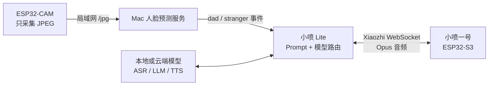

# 小喷 Lite（XiaoPen Lite）

> 轻量、本地优先的 Xiaozhi 模型控制台与 ESP32 设备网关。

[](LICENSE)
[](https://nodejs.org/)
[](#测试)

小喷 Lite 用来管理家里的“小喷一号”：在一个本地网页中配置 LLM、ASR、
TTS、视觉模型、API Key、角色 Prompt、任务路由和隐私边界，同时给
ESP32-S3 提供兼容 Xiaozhi WebSocket v1 的语音网关。

它不是完整 Xiaozhi Server 的复刻。项目刻意保持轻量：不需要 Docker、
数据库、Redis 或消息队列，一条命令即可在 Mac 或其他电脑上启动。

## 功能

### 模型控制台

- 统一管理 LLM、ASR、TTS、Vision、Embedding Provider
- 支持 Ollama、llama.cpp 和 OpenAI-compatible 本地/云端 API
- 配置 Base URL、模型名称、API Key、TTS Voice、超时和启用状态
- 在保存前测试服务连通性并读取可用模型
- API Key 只交给本地后端，保存后浏览器只能看到末四位

### Prompt 与模型路由

- 编辑“小喷一号”的角色 Prompt
- 分别配置“爸爸回家”和“陌生人警戒”提示词
- 为普通语音对话选择独立的 ASR → LLM → TTS 链路
- 为门口事件选择更快的 LLM、TTS 和视觉模型
- 在控制台中预览 LLM 生成的回家或警戒台词

### 本地隐私边界

- 默认禁止原始音频、摄像头图片和转写文字发送到云端
- 即使误选云端 Provider，未授权的数据仍会在调用前被拦截
- 配置、密钥、Prompt 与审计记录全部保存在本机
- 管理 API 只监听 `127.0.0.1`，不会暴露到局域网
- 设备网关使用可轮换的 Bearer Token

### Xiaozhi 设备网关

- Xiaozhi WebSocket v1 鉴权和 `hello` 握手
- ESP32-S3 Opus 音频接收、简单 VAD、ASR、LLM、TTS 和 Opus 回传
- 使用 `Device-Id` + `Client-Id` 完成首次 OTA/WebSocket 地址发现
- 接受 Mac 人脸服务发布的 `dad` / `stranger` 结构化事件
- 在控制台查看网关状态、连接设备和最近错误

## 系统架构



设计原则是“事件联动，而不是固件互相依赖”：

- ESP32-CAM 只负责稳定采集图片
- Mac 负责人脸样本、训练、识别和隐私策略
- 小喷 Lite 负责模型、Prompt、语音链路和事件编排
- ESP32-S3 负责唤醒、录音、全屏颜文字和语音播报

因此更换摄像头、人脸模型、语音模型或 S3 硬件时，不需要重写其他模块。

## 硬件材料

只体验控制台不需要 ESP32，一台能运行 Node.js 的电脑即可。完整“小喷一号 +
门口摄像头”方案使用以下材料。

| 材料 | 建议规格 | 数量 | 用途 |
| --- | --- | ---: | --- |
| 小喷一号主板 | CoolKit XZ-02，ESP32-S3 N16R8 | 1 | 唤醒、语音交互、表情显示 |
| 显示屏 | XZ-02 板载 1.54 英寸 240×240 TFT | 1 | 全屏桌面宠物颜文字 |
| 麦克风与扬声器 | XZ-02 板载 I2S 音频硬件 | 1 套 | 录音与播报 |
| 摄像头 | AI-Thinker ESP32-CAM + OV2640 | 1 | 门口 JPEG 图像采集 |
| 摄像头下载工具 | ESP32-CAM-MB 下载底板或 5V USB-TTL | 1 | 烧录摄像头固件 |
| 主机 | Apple Silicon / Intel Mac，或其他 Node.js 主机 | 1 | 控制台、模型和人脸服务 |
| Wi-Fi | 2.4 GHz 局域网 | 1 | ESP32-CAM 仅支持 2.4 GHz |
| 电源与线材 | 稳定 5V 电源、USB 数据线；USB-TTL 方案另需杜邦线 | 若干 | 供电、烧录与调试 |

对应硬件固件独立维护：

- 小喷一号 ESP32-S3 固件：暂未随本仓库公开发布
- [ESP32-CAM 采集固件](https://github.com/jiaqianjing/esp32-cam-learning)

本仓库是本地控制面和设备网关，不包含上述两块板子的完整固件。

### ESP32-CAM 使用 USB-TTL 烧录

```text
USB-TTL GND  -> ESP32-CAM GND
USB-TTL 5V   -> ESP32-CAM 5V
USB-TTL TXD  -> ESP32-CAM U0R / RX
USB-TTL RXD  -> ESP32-CAM U0T / TX
ESP32-CAM IO0 -> GND（仅刷写时连接）
```

使用 3.3V 逻辑电平的 USB-TTL，并为 ESP32-CAM 提供稳定的 5V 电源。
刷写完成后断开 IO0 与 GND，再复位进入正常启动。

## 快速开始

### 环境要求

- Node.js 22.13 或更高版本
- npm
- macOS、Linux 或 Windows

### 安装与运行

```bash
git clone https://github.com/jiaqianjing/xiaopen-lite.git
cd xiaopen-lite
npm install
npm run dev
```

打开 [http://127.0.0.1:3000](http://127.0.0.1:3000)。

`npm run dev` 会同时启动：

| 地址 | 作用 | 暴露范围 |
| --- | --- | --- |
| `127.0.0.1:3000` | React 管理页面 | 仅本机 |
| `127.0.0.1:8090` | 管理 API | 仅本机 |
| `0.0.0.0:8091` | ESP32 设备网关 | 局域网，设备身份发现 + Token 会话鉴权 |

生产构建与启动：

```bash
npm run build
npm start
```

## 配置模型

打开“模型服务”并新建 Provider。

| 服务 | Driver | Base URL 示例 | 备注 |
| --- | --- | --- | --- |
| Ollama | `Ollama` | `http://127.0.0.1:11434` | 本地 LLM |
| llama.cpp | `OpenAI-compatible` | `http://127.0.0.1:8080/v1` | 本地 LLM |
| Whisper 兼容 ASR | `OpenAI-compatible` | `http://127.0.0.1:端口/v1` | 需要 `/audio/transcriptions` |
| OpenAI 兼容 TTS | `OpenAI-compatible` | `http://127.0.0.1:端口/v1` | 需要 `/audio/speech`，返回 Ogg/Opus |
| 云端 API | `OpenAI-compatible` | 云服务商提供的 `/v1` 地址 | 需要 API Key 和隐私授权 |

推荐操作顺序：

1. 分别录入并测试 LLM、ASR、TTS Provider。
2. 在“模型路由”中选择普通对话和门口事件链路。
3. 根据需要修改角色和门口事件 Prompt。
4. 在“隐私与审计”中明确允许哪些数据可以出站。
5. 最后再将 ESP32-S3 切换到本地设备网关。

## 门口事件接口

完整设备 Token 只在控制台执行轮换时显示一次。Mac 人脸预测服务识别完成后，
可以向当前连接的小喷发送事件：

```bash
curl -X POST http://MAC局域网IP:8091/events \
  -H "Authorization: Bearer 设备Token" \
  -H "Content-Type: application/json" \
  -d '{"identity":"dad"}'
```

陌生人事件：

```bash
curl -X POST http://MAC局域网IP:8091/events \
  -H "Authorization: Bearer 设备Token" \
  -H "Content-Type: application/json" \
  -d '{"identity":"stranger"}'
```

网关根据身份选择 Prompt，调用配置的 LLM 生成不同台词，再通过 TTS 合成并以
Opus 音频发送给小喷。主动播报要求小喷当前已连接设备网关。

## 数据与密钥

默认数据目录是 `~/.xiaopen-lite`：

| 文件 | 内容 | 权限 |
| --- | --- | --- |
| `config.json` | 不含完整 API Key 的模型与路由配置 | `0600` |
| `vault.json` | AES-256-GCM 加密后的 API Key 和设备 Token | `0600` |
| `vault.key` | 本机随机生成的主密钥 | `0600` |
| `audit.jsonl` | 不记录 API Key 的本地审计事件 | `0600` |

可以通过环境变量修改数据目录：

```bash
XIAOPEN_DATA_DIR=/自定义/数据目录 npm start
```

这套加密主要避免配置文件被直接读取。若操作系统账户本身已经失陷，攻击者仍可能
同时读取密文和主密钥。建议启用 FileVault 或同类全盘加密，并保护好主机账户。

## 项目结构

```text
xiaopen-lite/
├── src/                 # React 本地控制台
├── server/
│   ├── api.ts           # 仅本机可访问的管理 API
│   ├── gateway.ts       # Xiaozhi WebSocket 与门口事件网关
│   ├── providers.ts     # LLM / ASR / TTS Provider 适配
│   ├── store.ts         # 配置、加密密钥仓库和审计
│   └── ogg.ts           # Ogg / Opus 封装与解析
├── tests/               # 构建、安全和设备网关集成测试
└── scripts/             # 本地双进程启动脚本
```

## 测试

```bash
npm run typecheck
npm test
npm audit
```

当前测试覆盖：

- API Key 加密保存且不通过配置 API 返回
- 删除 Provider 时清理密钥和路由引用
- Provider 连接测试使用加密仓库中的凭据
- 默认隐私策略阻止文字进入云端 LLM
- 原始 Opus 帧与 Ogg 容器转换
- Xiaozhi WebSocket Token 鉴权和 `hello` 握手
- 门口事件经过本地 LLM、TTS 并向设备回传 Opus
- 前端生产构建包含完整控制台

## 当前边界

- Vision 路由和管理界面已经预留；人脸训练与预测服务仍作为独立 Mac 服务运行。
- 当前实现聚焦单家庭、单机控制面，不提供多租户和公网管理。
- 设备网关使用局域网 HTTP/WebSocket；不要直接映射到公网。
- 首次 OTA 发现依赖 Xiaozhi 固件提供的 `Device-Id` 和 `Client-Id`；它是局域网配对机制，不替代 TLS 或零信任网络。
- ESP32-S3 和 ESP32-CAM 的烧录、板级配置请查看各自固件仓库。

## 参与贡献

欢迎提交 Issue 和 Pull Request。涉及新 Provider 时，请同时补充：

- API 兼容方式和最小配置示例
- 本地与云端数据边界
- 自动化测试
- 不含真实 API Key、Wi-Fi 密码或人脸数据的日志

## License

[MIT](LICENSE) © 2026 jiaqianjing
