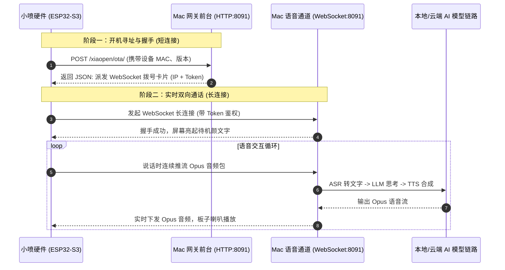

# ESP32 设备连接、通信原理与故障排查指南

本文档记录了“小喷一号”（ESP32-S3 端侧 xiaopen-device）与本地“小喷 Hub”（XiaoPen Hub / xiaopen-hub）之间的通信架构、握手流程以及常见连接报错排查方案。

---

## 1. 架构演进：从云端小智到本地小喷

| 对比维度 | 原版小智云端方案 (`xiaozhi.me`) | 小喷 Hub 本地优先方案 (`xiaopen-hub`) |
| :--- | :--- | :--- |
| **控制台** | 公网控制台：`https://xiaozhi.me/console/agents` | 本地网页控制台：`http://127.0.0.1:3000` |
| **设备网关 / AI 大脑** | 部署在小智官方云服务器 (`mqtt.xiaozhi.me`) | **运行在您本地的 Mac 电脑** (`0.0.0.0:8091`) |
| **硬件角色 (ESP32-S3)** | 仅作为带屏对讲机，麦克风录音上传，喇叭播报 | 同样作为轻量对讲机，通过局域网直连本地 Mac |
| **语音数据流向** | 麦克风音频 -> 上传公网第三方服务器 -> AI 模型 | **麦克风音频 -> 局域网传输到 Mac 本地 -> 纯本地处理** |
| **隐私与网络** | 依赖稳定外网，音频出公网 | 零公网依赖，家庭隐私不出门，断网仍可本地对话 |

> **说明**：硬件板载 Flash（NVS）中如果看到 `mqtt.xiaozhi.me` 或 `Xiaozhi-XXXX` 热点名，是因为硬件和基础底层衍生自官方开源小智项目。小喷 Hub 则是将这套云端“大脑”彻底替换为本地私有化实现。

---

## 2. 设备与网关的两阶段通信机制

ESP32-S3 算力较弱，无法在芯片上直接运行大语言模型与语音合成。它与 Mac 之间遵循 XiaoPen Device Protocol v1，分为两个阶段：



### 阶段一：HTTP OTA 握手与服务发现（门童前台）
* **接口地址**：`http://<Mac_IP>:8091/xiaopen/ota/`
* **作用**：
  1. **检查版本更新**：查询是否有更新版本的固件。
  2. **派发语音服务器联系方式（服务发现）**：下发一段 JSON，告诉板子真正跑模型的 WebSocket 地址和认证 Token：
     ```json
     {
       "websocket": {
         "url": "ws://192.168.31.157:8091/xiaopen/v1/",
         "token": "db7c739e5ba3e6065434b222fcc17b1583b898b1fce30905",
         "version": 1
       }
     }
     ```

### 阶段二：WebSocket 实时双向通话（专属热线）
* **接口地址**：`ws://<Mac_IP>:8091/xiaopen/v1/`
* **作用**：
  * 板子根据前台派发的地址与 Token 拨通该长连接。
  * 保持不挂断的双向通道，低延迟流式互传 Opus 压缩音频、表情显示命令与 MCP 工具指令。

---

## 3. 常见报错排查：为什么设备一直在报 `select() timeout`？

### 现象特征
通过串口监控（如 `/dev/cu.usbmodem*`）可以看到类似循环刷屏日志：
```text
I Ota: Current version: 2.3.0
I EspTcp: Resolved 192.168.31.216 -> 192.168.31.216
E esp-tls: [sock=54] select() timeout
E transport_base: Failed to open a new connection: 32774
E HTTP_CLIENT: Connection failed, sock < 0
W Application: Check new version failed, retry in 10 seconds (1/10)
```
同时设备屏幕停留在“正在启动 / 正在激活”状态。

### 根本原因
1. **Mac 局域网 IP 发生漂移**：
   * 固件在编译时可能硬编码了某个默认的 OTA 握手地址（例如 `192.168.31.216`）。
   * 当 Mac 电脑重连 Wi-Fi 或路由器重新分配 DHCP 时，Mac 的实际 IP 变成了新的地址（如 `192.168.31.157`）。
2. **前台门童失联导致无法拨通语音电话**：
   * 板子开机第一件事必须去访问 `http://192.168.31.216:8091/xiaopen/ota/` 问路。
   * 因为 `.216` 目标不可达，板子无法获取到真正的 WebSocket 联系方式，根据固件启动逻辑，只能在原地不断超时重试。

---

## 4. 解决方案

### 方案 1：临时为 Mac 网卡添加 IP 别名（最快，免动硬件）
让 Mac 同时响应旧的 IP 地址，只要网关处于运行状态，设备连通后就会瞬间上线：
```bash
# 添加别名（需管理员密码）
sudo ifconfig en0 alias 192.168.31.216 255.255.255.0

# 验证是否生效
ifconfig en0 | grep "inet "

# 如需移除（或重启 Mac 自动失效）
sudo ifconfig en0 -alias 192.168.31.216
```

### 方案 2：重新配网修改服务器地址（硬件方式）
1. 长按板子上的 **BOOT / 功能按键** 3~5 秒，强制设备进入 AP 配网模式。
2. 手机或电脑连上板子发出的 Wi-Fi 热点（如 `Xiaozhi-F765`）。
3. 浏览器访问 `192.168.4.1`，将服务端地址修改为当前 Mac 的实际 IP：
   ```text
   ws://当前Mac局域网IP:8091/xiaopen/v1/
   ```
4. 保存后设备会自动重启连接。

### 方案 3：在 Mac 网络设置中绑定静态 IP
为彻底避免 Mac 每次连 Wi-Fi 导致 IP 漂移：
1. 打开 Mac **「系统设置」** -> **「网络」** -> 选择 **Wi-Fi** -> **「详细信息」**。
2. 选择 **「TCP/IP」**，在“配置 IPv4”中选择“使用 DHCP（手动机号）”或“手动”。
3. 将 IP 地址固定为一个固定的值（如 `192.168.31.216`）。

### 方案 4：高级架构升级（公网寻址或 mDNS 域名）
* **mDNS 局域网域名**：把固件默认地址改为域名 `http://xiaopen.local:8091/xiaopen/ota/`，通过 Mac 自带的 Bonjour 协议自动广播解析，免受 IP 变化影响。
* **Cloudflare Workers 免费公网寻址**：将 OTA 接口部署在 Cloudflare Workers 上（免费获得永久公网 HTTPS 域名），板子永远向公网地址查询当前 Mac 的局域网或内网穿透 IP。
